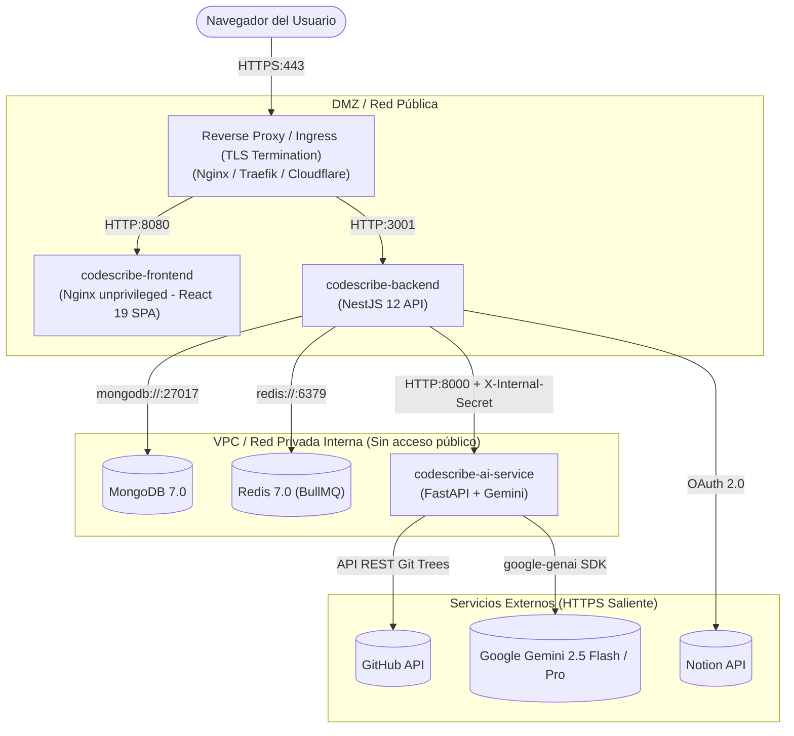

# Guía y Checklist de Despliegue en Producción — CodeScribe AI

Este documento detalla los pasos de preparación, aprovisionamiento, verificación de seguridad y operaciones de mantenimiento para desplegar **CodeScribe AI** en un entorno de producción.

---

## 📋 Resumen de la Arquitectura en Producción



---

## 🛠️ Checklist Pre-Lanzamiento (Manual de Kathy)

Antes de iniciar los contenedores en producción, asegúrate de completar y registrar las siguientes credenciales:

### 1. Generación de Secretos Criptográficos
Ejecuta en tu terminal para generar claves seguras de alta entropía:
```bash
# Para JWT_SECRET (mínimo 32 caracteres)
openssl rand -hex 32

# Para AI_SERVICE_SECRET (mínimo 16 caracteres)
openssl rand -hex 24

# Para GITHUB_TOKEN_ENCRYPTION_KEY (exactamente 32 caracteres / 32 bytes)
openssl rand -hex 16
```

- [ ] Generar y guardar `JWT_SECRET` en el gestor de secretos / `.env`.
- [ ] Generar y guardar `AI_SERVICE_SECRET` (idéntico en backend y motor de IA).
- [ ] Generar y guardar `GITHUB_TOKEN_ENCRYPTION_KEY` (exactamente 32 caracteres).
- [ ] Cargar `GEMINI_API_KEY` válida desde [Google AI Studio](https://aistudio.google.com/).

### 2. Configuración de GitHub OAuth App
En [GitHub Developer Settings > OAuth Apps](https://github.com/settings/developers):
- [ ] Crear o actualizar la aplicación con:
  - **Application name:** `CodeScribe AI`
  - **Homepage URL:** `https://tudominio.com` (o `http://localhost`)
  - **Authorization callback URL:** `https://api.tudominio.com/api/auth/github/callback`
- [ ] Guardar `GITHUB_CLIENT_ID` y `GITHUB_CLIENT_SECRET`.
- [ ] Generar un **Personal Access Token (PAT)** de GitHub de solo lectura (`public_repo`) para `GITHUB_FALLBACK_TOKEN` (evita agotar el límite de 60 req/h de la API anónima de GitHub durante las visitas en modo demo).

### 3. Configuración de Notion Public Integration (OAuth)
En [Notion Developers Portal > My Integrations](https://www.notion.so/profile/integrations):
- [ ] Crear integración de tipo **Public Integration**.
- [ ] Configurar **Redirect URI:** `https://tudominio.com/auth/notion/callback`
- [ ] Asignar Capabilities:
  - *Read content*
  - *Update content*
  - *Insert content*
- [ ] Guardar `NOTION_CLIENT_ID`, `NOTION_CLIENT_SECRET` y registrar la URI en `NOTION_REDIRECT_URI`.

### 4. Definición de Dominios, TLS y CORS
- [ ] Configurar registros DNS para el Frontend (`tudominio.com`) y Backend (`api.tudominio.com`).
- [ ] Obtener certificados TLS (Let's Encrypt / Certbot) con renovación automática.
- [ ] Ajustar variables de alineación de URLs:
  - `FRONTEND_URL=https://tudominio.com`
  - `VITE_API_URL=https://api.tudominio.com/api`
  - `ALLOWED_ORIGINS=https://tudominio.com,https://api.tudominio.com`

---

## 🚀 Despliegue con Docker Compose

### 1. Clonar y Configurar Entorno
```bash
cp .env.example .env
nano .env   # Cargar los secretos y URLs de producción definidos arriba
```

### 2. Construir e Iniciar Servicios
```bash
docker compose up -d --build
```

### 3. Verificar Estado de Salud
```bash
docker compose ps

# Verificar respuesta de salud del Backend
curl -f https://api.tudominio.com/api/health

# Verificar logs del servicio de IA
docker compose logs ai-service --tail=50
```

---

## 🛡️ Verificación de Políticas de Seguridad

- [ ] **Aislamiento del Motor de IA:** Confirmar que el puerto `8000` **no** esté expuesto en la interfaz pública (`netstat -tuln` o `nmap`). Solo debe responder internamente a las peticiones del backend.
- [ ] **Sin Tokens en URLs:** Realizar un flujo de login completo y comprobar en las herramientas de desarrollador que:
  - La redirección tras el login utiliza `?code=...` (sin `?jwt=...`).
  - La conexión SSE a `/api/jobs/:id/stream` no viaja con `?token=...`, sino con la cabecera `Authorization: Bearer <token>`.
- [ ] **Cabeceras HTTP y CSP:** Comprobar que Helmet y Nginx responden con:
  - `Content-Security-Policy` estricto (sin `unsafe-eval` en scripts).
  - `X-Frame-Options: DENY`
  - `X-Content-Type-Options: nosniff`
  - `Strict-Transport-Security` (HSTS habilitado).
- [ ] **Protección Anti-XSS en Mermaid:** Confirmar que los diagramas renderizados se configuran con `securityLevel: 'strict'` y son filtrados por DOMPurify antes de su inyección en el DOM.

---

## 💾 Respaldo y Mantenimiento de Bases de Datos

### Respaldo Automatizado de MongoDB
Para programar un volcado periódico de la base de datos de producción mediante un trabajo Cron:

```bash
# Script de backup diario: /usr/local/bin/backup-codescribe.sh
#!/bin/bash
BACKUP_DIR="/var/backups/codescribe/$(date +%Y-%m-%d)"
mkdir -p "$BACKUP_DIR"
docker exec codescribe-mongo mongodump --db codescribe --out /tmp/dump
docker cp codescribe-mongo:/tmp/dump/codescribe "$BACKUP_DIR"
docker exec codescribe-mongo rm -rf /tmp/dump
find /var/backups/codescribe/ -mindepth 1 -maxdepth 1 -type d -mtime +14 -exec rm -rf {} +
```

Dar permisos de ejecución y registrar en `crontab -e`:
```text
0 3 * * * /usr/local/bin/backup-codescribe.sh > /var/log/codescribe-backup.log 2>&1
```

---

## 📈 Monitoreo y Observabilidad

1. **Endpoint de Salud General:** `GET /api/health` retorna `{ "status": "ok", "timestamp": "...", "database": { "status": "connected" } }`.
2. **Diagnóstico del Motor:** Ejecutar dentro del contenedor: `docker exec codescribe-ai-service python -c "import urllib.request; print(urllib.request.urlopen('http://localhost:8000/health').read().decode())"`.
3. **Métricas de Colas BullMQ:** Inspeccionar el volumen de tareas activas, en espera y fallidas monitoreando la clave de Redis `bull:analysis:id`.
